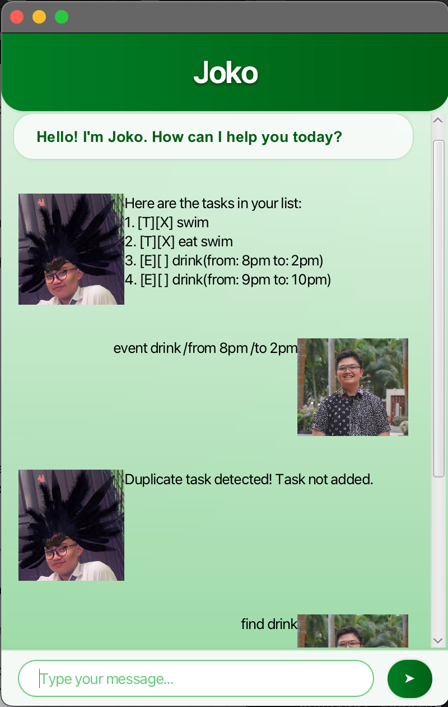

# Joko Chatbot – User Guide



Welcome to **Joko**, your friendly chatbot assistant.
This guide will help you get started and make the most out of Joko.

---

## 🚀 Getting Started

1. **Launch the application** by running the provided JAR file or starting it from your IDE.
2. Once launched, you will see:

    * A **chat area** where messages appear.
    * A **text box** at the bottom where you can type.
    * A **send button ➤** to send your input.

---

## ✨ Features

### 💬 Chat with Joko

* Type your message in the text box and press **Enter** or click the **➤ Send** button.
* Joko will reply in the chat area.

### 📝 Task Management

* Add a task:

  ```
  todo Buy groceries
  ```
* Add a deadline:

  ```
  deadline Submit report /by 2025-09-21
  ```
* Add an event:

  ```
  event Meeting /from Monday 2pm /to Monday 4pm
  ```
* List all tasks:

  ```
  list
  ```
* Mark a task as done:

  ```
  mark 1
  ```
* Mark a task as done:

  ```
  unmark 1
  ```
* Delete a task:

  ```
  delete 2
  ```

### ❌ Exiting

* Type `bye` to close the chatbot safely.

---

## 🎨 Interface

* **Header**: Shows app name "Joko".
* **Chat area**: Displays conversation history.
* **Input bar**: Type your commands here.
* **Send button**: Sends your message.

---

## ⚠️ Notes

* Commands are **case-insensitive**.
* Always provide correct date/time format for deadlines and events.
* Your tasks are saved automatically (if persistent storage is implemented).

---

## 📖 Example Usage

```
> todo Finish homework
Got it. I've added this task: Finish homework

> list
1. [T][ ] Finish homework

> done 1
Nice! I've marked this task as done.
```

---

## 📍 Quick Reference

| Command    | Description                | Example                           |
|------------|----------------------------|-----------------------------------|
| `todo`     | Adds a task                | `todo Buy milk`                   |
| `deadline` | Adds a task with deadline  | `deadline project /by 2025-09-21` |
| `event`    | Adds an event              | `event meeting /from 2pm /to 4pm` |
| `list`     | Shows all tasks            | `list`                            |
| `mark`     | Marks a task as done       | `mark 2`                          |
| `unmark`   | Unmarks a task as not done | `unmark 2`                        |
| `delete`   | Deletes a task             | `delete 3`                        |
| `bye`      | Exits chatbot              | `bye`                             |

---

Enjoy chatting with **Joko** 🎉
